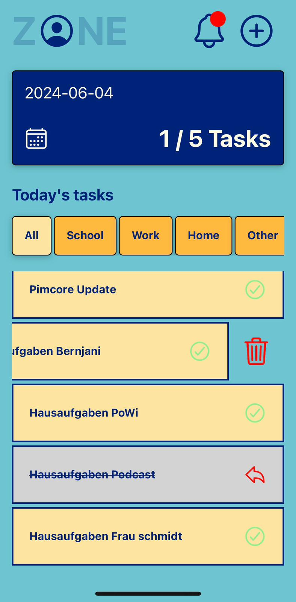
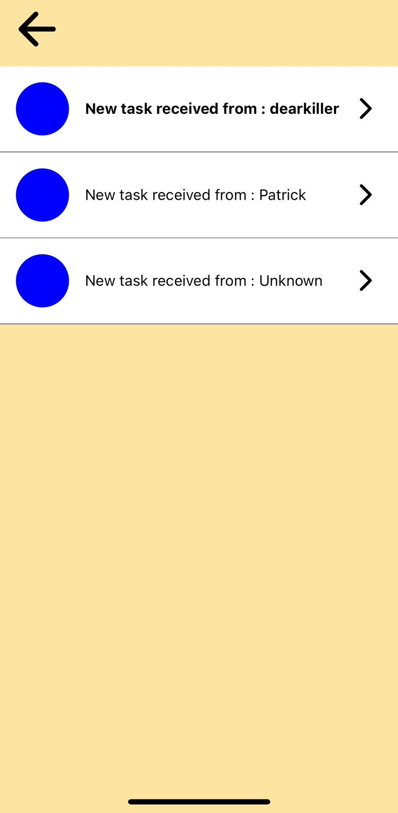
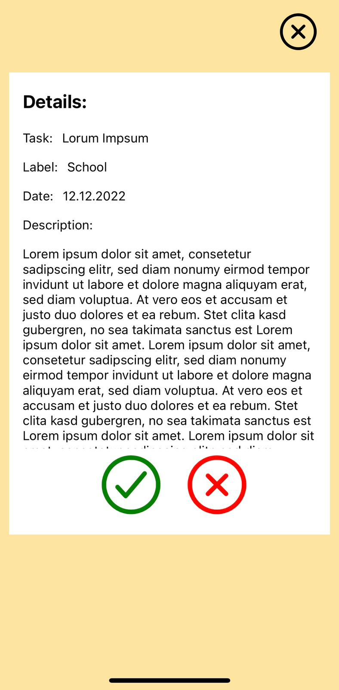
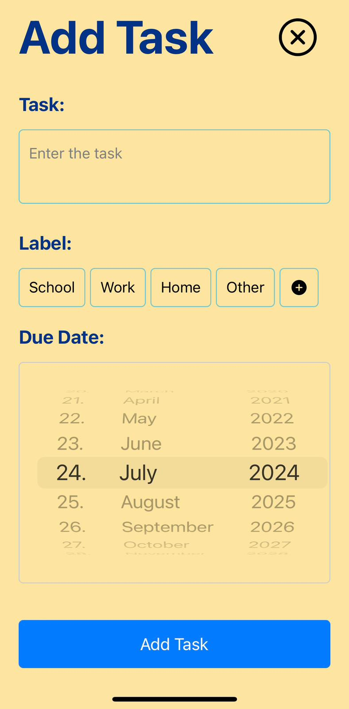
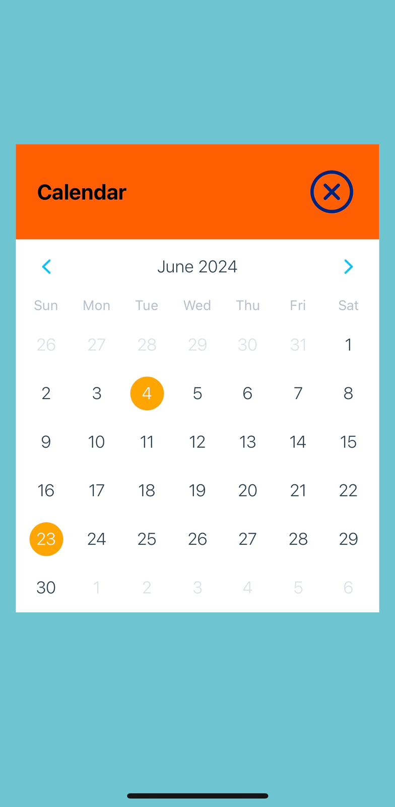

# 📝 Simple Task Planner

Welcome to the **Simple Task Planner** app! This project is a simple task or to-do planner that I created to learn React Native. The app is built using **React Native** and **Supabase** for the backend.

## 📱 Features

- Add, edit, and delete tasks
- Mark tasks as completed
- Organize tasks by categories
- Real-time updates with Supabase

## 🛠️ Technologies

- **React Native**: For building the mobile application.
- **Expo**: To assist in development, build, and deploy React Native apps.
- **Supabase**: For the backend, including database, authentication, and real-time updates.

## 🚀 Getting Started

### Prerequisites

- Install **Node.js** from [nodejs.org](https://nodejs.org/)
- Install **Expo CLI** by running the following command:

  ```bash
  npm install -g expo-cli
Install Expo Go on your mobile device from the App Store (iOS) or Google Play (Android).
Installation
Clone the repository:

bash
Copy code
git clone https://github.com/TeddyChristian/zone-app.git
cd zone-app
Install the dependencies:

npm install

Start the development server:

expo start

Scan the QR code displayed in the terminal or Metro Bundler page with Expo Go.


📸 Screenshots

 
 





🌐 Backend Setup

Create a new project in Supabase.

Copy your Supabase URL and anon key.

Create a .env file in the root of your project and add the 

following:

SUPABASE_URL=your-supabase-url
SUPABASE_ANON_KEY=your-supabase-anon-key

💡 Learning Objectives

This project helped me learn and understand the following:

Basics of React Native
Using Expo for development and deployment
Setting up and using Supabase for backend services
Handling user authentication and real-time data

🤝 Contributing

Contributions, issues, and feature requests are welcome! Feel free to check the issues page.

Fork the project

Create your feature branch (git checkout -b feature/AmazingFeature)
Commit your changes (git commit -m 'Add some AmazingFeature')
Push to the branch (git push origin feature/AmazingFeature)